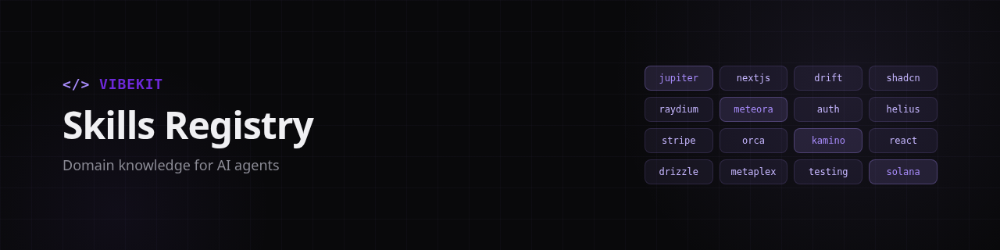

<p align="center">
  
</p>

# VibeKit Skills Registry

Domain skills for [VibeKit](https://vibekit.bot) AI agents. Protocol docs, code patterns, and integration guides — fetched on-demand so your agent knows how to build with any framework or protocol.

## What are Skills?

Skills are structured knowledge packs that teach AI agents how to use specific tools, frameworks, and protocols. When your agent needs to swap tokens on Jupiter or build a Next.js app, it pulls the relevant skill — no prompt bloat, no hallucinated APIs.

## Available Skills

| Category | Skills |
|----------|--------|
| **Frontend** | `nextjs` `shadcn` `react-expert` `react-perf` `responsive-design` `animations` `loading-states` |
| **Backend** | `backend` `trpc` `error-handling` `rate-limiting` `caching` `logging` `websocket` |
| **Database** | `drizzle` |
| **Security** | `auth` `security` |
| **Quality** | `typescript` `testing` `clean-code` `accessibility` `conventional-commits` |
| **DevOps** | `docker` `api-design` |
| **Payments** | `stripe` |
| **Solana DeFi** | `jupiter` `raydium` `drift` `meteora` `orca` `kamino` `marginfi` `pumpfun` `dflow` `glam` `swig` |
| **Solana Infra** | `solana` `solana-agent` `helius` `metaplex` `crossmint` `breeze` |
| **Market Data** | `coingecko` |
| **Foundation** | `design` `workspace` `regex` |

## Quick Start

### Via VibeKit API

```bash
curl -X POST https://vibekit.bot/api/v1/task \
  -H "Authorization: Bearer YOUR_API_KEY" \
  -d '{"prompt": "Build a dashboard with auth", "skills": ["nextjs", "auth"]}'
```

Skills are auto-detected from your prompt, or specify them explicitly.

### Via MCP (for AI agents)

```typescript
const skills = await mcp.call("list_skills");
const jupiter = await mcp.call("get_skill", { id: "jupiter" });
```

### Direct Fetch

```bash
curl https://raw.githubusercontent.com/vibekit-apps/skills-registry/main/skills/jupiter/SKILL.md
```

## Skill Format

Each skill lives in its own directory with a `SKILL.md` entry point. Larger skills include docs, examples, and templates:

```
skills/
├── jupiter/
│   └── SKILL.md              # Single-file skill
├── drift/
│   ├── SKILL.md              # Entry point
│   ├── docs/                  # Deep-dive guides
│   ├── examples/              # Working code samples
│   ├── resources/             # API references
│   └── templates/             # Starter code
└── ...
```

## Contributing

1. Fork this repo
2. Create `skills/your-skill/SKILL.md`
3. Add an entry to `skills.json`
4. Submit a PR

See existing skills for format reference. Skills should be actionable — working code over theory.

## License

MIT
